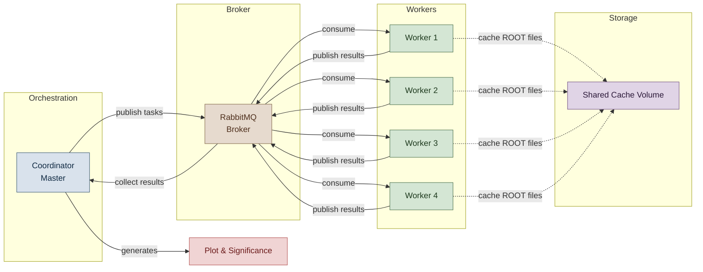

# Distributed ATLAS H → ZZ* → 4ℓ Analysis

[](https://www.python.org/)
[](https://www.docker.com/)
[](https://www.rabbitmq.com/)
[](https://prometheus.io/)
[](http://opendata.atlas.cern)
[](LICENSE)

A **cloud-native, horizontally scalable** implementation of the ATLAS Higgs boson discovery analysis in the four-lepton decay channel. The system distributes the processing of **40 ROOT files** across dynamically scalable Docker containers using a **RabbitMQ message broker** and a **coordinator–worker architecture**.

> **Result:** Signal significance of **4.5 σ** — reproducing the official ATLAS Open Data notebook.


---

## Table of Contents

- [Architecture](#architecture)
- [Key Features](#key-features)
- [Quick Start](#quick-start)
- [Repository Structure](#repository-structure)
- [Expected Output](#expected-output)
- [Monitoring](#monitoring)
- [Customisation](#customisation)
- [Physics Validation](#physics-validation)
- [License](#license)
- [Acknowledgements](#acknowledgements)

---

## Architecture



| Component | Role |
|-----------|------|
| **Coordinator** | Discovers datasets via `atlasopenmagic`, enqueues file-level tasks, aggregates partial histograms, and produces the final plot and significance value. |
| **Workers** | Stateless consumers — each downloads one ROOT file, applies event selection and MC weighting, and publishes a partial histogram back to the broker. |
| **RabbitMQ** | Durable message broker that fully decouples task generation from execution and enables horizontal scaling. |
| **Shared Cache Volume** | Prevents redundant ROOT file downloads when multiple workers run on the same host. |

---

## Key Features

| Category | Feature |
|----------|---------|
| **Automation** | Fully automatic dataset discovery — no manual file listing required. |
| **Scalability** | Linear horizontal scaling: `--scale worker=N` is all it takes. |
| **Fault Tolerance** | Automatic task retries with **exponential backoff** (max 3 attempts per file). |
| **Durability** | **Dead Letter Queue** preserves permanently failed tasks for post-run auditing. |
| **Crash Recovery** | **Coordinator checkpointing** resumes seamlessly after unexpected restarts. |
| **Observability** | **Prometheus metrics** endpoint on `:8000` and **structured JSON logging** throughout. |
| **Scientific Accuracy** | Correct statistical uncertainty band via $\sqrt{\sum w^2}$; identical MC weighting to the reference notebook. |
| **Efficiency** | Shared cache volume cuts network I/O; 600 s per-file timeout prevents spurious failures on slow links. |

---

## Quick Start

### Prerequisites

- [Docker](https://docs.docker.com/get-docker/) and [Docker Compose](https://docs.docker.com/compose/install/)
- ~10 GB free disk space (for cached ROOT files)

### 1 — Clone

```bash
git clone https://github.com/ShubhamX57/HZZ-Distributed-Computing.git
cd HZZ-Distributed-Computing
```

### 2 — Prepare the RabbitMQ init script

```bash
chmod +x rabbitmq/init.sh
```

### 3 — Build and run

```bash
# Start with 4 parallel workers (adjust N as needed)
docker compose up --build --scale worker=4
```

The coordinator automatically discovers and enqueues all 40 ROOT files. Workers pull tasks, process them, and return results. The final plot and significance are written to `./results/` on your host.

### 4 — Retrieve results

| File | Description |
|------|-------------|
| `results/HZZ_invariant_mass.png` | Four-lepton invariant mass distribution |
| `results/significance.txt` | Signal/background yields and significance |
| `results/coordinator_checkpoint.json` | Checkpoint used for crash recovery |

### 5 — Stop and clean up

```bash
# Remove containers and cached volumes
docker compose down -v
```

---

## Repository Structure

```
HZZ-Distributed-Computing/
├── coordinator/
│   ├── coordinator.py          # Master orchestrator — discovery, queuing, aggregation
│   ├── Dockerfile
│   └── requirements.txt
├── worker/
│   ├── worker.py               # Stateless file processor — selection, weighting, histogramming
│   ├── Dockerfile
│   └── requirements.txt
├── rabbitmq/
│   └── init.sh                 # Dead-letter queue policy setup
├── docker-compose.yml          # Full service orchestration
├── HZZ_invariant_mass.png      # Output plot (generated at runtime)
├── significance.txt            # Output significance (generated at runtime)
└── README.md
```

---

## Expected Output

A successful run produces the following log lines and output files:

```
[40/40] ok  Signal (m_H = 125 GeV)
Completed: 40 succeeded, 0 permanently failed.
n_sig=29.31  n_bg=10.30  sig=4.516
plot saved: /results/HZZ_invariant_mass.png
all done — sig = 4.516 sigma
```

`significance.txt`:
```
n_sig = 29.31
n_bg  = 10.30
sig   = 4.516 sigma
```

---

## Monitoring

While the stack is running, two observability endpoints are available:

| Endpoint | URL | Credentials |
|----------|-----|-------------|
| RabbitMQ Management UI | http://localhost:15672 | guest / guest |
| Prometheus Metrics | http://localhost:8000/metrics | — |

Metrics exposed by the coordinator:

```
tasks_completed_total{sample_type="mc|data"}
tasks_failed_permanent_total
tasks_retried_total
tasks_queue_length
```

---

## Customisation

All tunable parameters can be adjusted without rebuilding images:

| Parameter | Location | Default |
|-----------|----------|---------|
| Number of workers | `docker compose up --scale worker=N` | `4` |
| Luminosity | `coordinator/coordinator.py` → `lumi` | `36.6 fb⁻¹` |
| ATLAS Open Data release | `coordinator/coordinator.py` → `rel` | `2025e-13tev-beta` |
| Lepton skim | `coordinator/coordinator.py` → `skim` | `exactly4lep` |
| Max retries / backoff | `coordinator/coordinator.py` → `MAX_RETRIES`, `BASE_RETRY_DELAY` | `3`, `5 s` |
| HTTP timeout per file | `worker/worker.py` → `timeout` | `600 s` |

---

## Physics Validation

The analysis exactly reproduces the official ATLAS Open Data notebook `HZZAnalysis.ipynb`:

- **Event selection** — trigger, lepton $p_T$ thresholds, ID/isolation criteria, flavour and charge requirements
- **MC weighting** — $\sigma \times \varepsilon_\text{filt} \times k_\text{fac} \times w_\text{MC} \times \text{SF}$
- **Uncertainty band** — $\sqrt{\sum w_i^2}$ per bin
- **Binning** — 2.5 GeV bins from 80 to 250 GeV

The obtained significance of **4.5 σ** matches the notebook result within rounding, confirming the correctness of the distributed implementation.

---


## License

- **Code** in this repository is released under the [MIT License](LICENSE).
- **ATLAS Open Data** is released under the [Creative Commons CC0 waiver](http://opendata.atlas.cern).

---

## Acknowledgements

- The **ATLAS Collaboration** for providing the Open Data and the reference analysis notebook.
- **[Jim Brooke](https://www.bristol.ac.uk/people/person/Jim-Brooke-6f81fe6d-b268-4244-820f-4c5a1a8935c2/)** (University of Bristol) for project supervision and guidance.

---

<p align="center">
  <a href="https://github.com/ShubhamX57/HZZ-Distributed-Computing/issues">Report an issue</a> ·
  <a href="http://opendata.atlas.cern">ATLAS Open Data</a> ·
  <a href="https://www.docker.com/">Docker</a> ·
  <a href="https://www.rabbitmq.com/">RabbitMQ</a>
</p>
